# Deal Lifecycle: Shipment & Vault Integration Flow

> This document shows how Shipment and Vault processing integrates with a Deal's lifecycle, from creation through settlement and archival.

---

## 1. High-Level Overview

```mermaid
flowchart TB
    subgraph DEAL_ENTRY["PHASE 1: DEAL ENTRY"]
        A1[Deal Created / Amended] --> A2{Commit?}
        A2 -->|Yes| A3[Set SHIPPING_PEND<br/>Set VAULT_PEND]
        A2 -->|No| A4[Set DEALS_INCOMPLETE<br/>Still set VAULT_PEND]
        A3 --> A5[Validate Vault Dates<br/>per Product Type]
        A5 --> A6[Check Inventory Limits<br/>at Vault1 and Vault2]
        A6 -->|Breach| A7[InventoryLimitsBreachException<br/>unless override comment provided]
        A6 -->|Pass| A8[Deal Saved]
    end

    subgraph SHIPMENT_ASSIGN["PHASE 2: SHIPMENT ASSIGNMENT"]
        B1[Create Shipment Record<br/>SH-YYYYMMDD-NNNNN] --> B2[Attach Deal Legs<br/>to Shipment Record]
        B2 --> B3[Set leg.shipmentRecords<br/>Set leg.shippingStatusId<br/>Set leg.shipmentValReq<br/>Set leg.insuranceValReq]
        B3 --> B4[Calculate Shipment Value<br/>Buy: shipment + insurance<br/>Sell: shipment only]
    end

    subgraph BO_APPROVAL["PHASE 3: BO APPROVAL"]
        C1[BO Verification Queue] --> C2{Approve?}
        C2 -->|Approve to Level 3| C3{Product is<br/>CONS/DISW/DISN<br/>ECIB/ECIS?}
        C3 -->|Yes| C4[updateInventoryForDealQueues<br/>Adjust vault inventory]
        C3 -->|No| C5[No vault impact]
        C2 -->|Reject from Level 3+| C6[Reverse vault inventory<br/>for same products]
        C4 --> C7[Generate Settlements<br/>PAYMENTS_PEND]
        C5 --> C7
    end

    subgraph VAULT_PROC["PHASE 4: VAULT PROCESSING"]
        D1[Vault Queue] --> D2[Select Shipment Record]
        D2 --> D3[Choose Destination<br/>Vault Status]
        D3 --> D4[Update Vault Inventory<br/>Double-entry pattern]
        D4 --> D5[Update Leg Vault Status]
        D5 --> D6[Update Deal Vault Status]
        D6 --> D7[Log DealStatusTrail<br/>+ AuditTrail]
    end

    subgraph SHIP_RELEASE["PHASE 5: SHIPMENT RELEASE"]
        E1[Release Shipment] --> E2{All deals<br/>BO approved?}
        E2 -->|No| E3[ERROR: OERR003]
        E2 -->|Yes| E4{Stale legs?}
        E4 -->|Yes| E5[ERROR: DERR9997]
        E4 -->|No| E6{CUF deals<br/>settled?}
        E6 -->|No| E7[ERROR: ERRVAULTCUF]
        E6 -->|Yes| E8[Set SHIPPING_RELEASED]
    end

    subgraph AUTO_SETTLE["PHASE 6: AUTO-SETTLEMENT"]
        F1[Auto-Settlement<br/>Triggered] --> F2{Shipping =<br/>RELEASED?}
        F2 -->|No| F3[Skip]
        F2 -->|Yes| F4{Vault =<br/>DISPATCHED or<br/>PIECE COUNT?}
        F4 -->|No| F3
        F4 -->|Yes| F5{Product =<br/>BKN_NORM or TCQ?<br/>DealType = INTRA?<br/>Customer = INTRA?}
        F5 -->|No| F3
        F5 -->|Yes| F6[PAYMENTS_SETTLED<br/>Auto-Settlement Complete]
    end

    A8 --> B1
    B4 --> C1
    C7 --> D1
    D7 --> E1
    E8 --> F1
```

---

## 2. Detailed Flow: Deal Creation

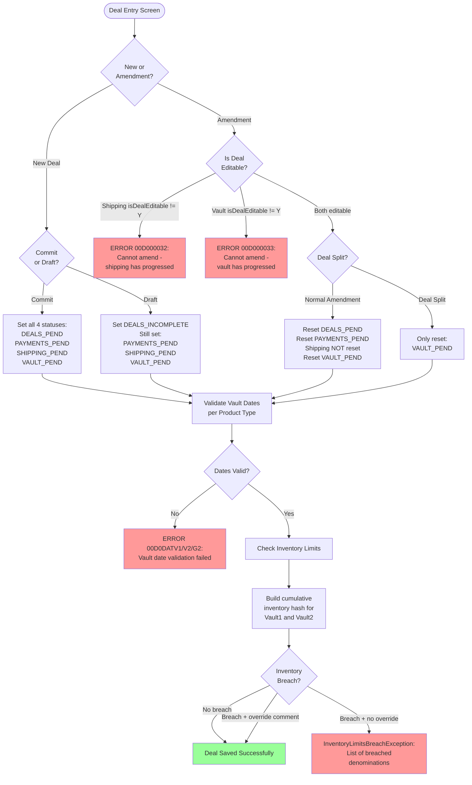

---

## 3. Vault Date Validation Rules by Product

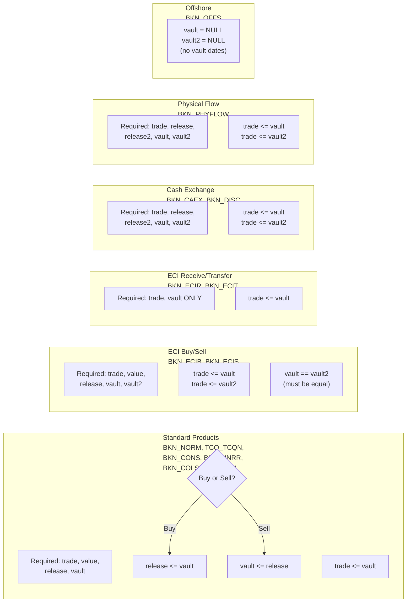

---

## 4. Shipment Assignment Flow

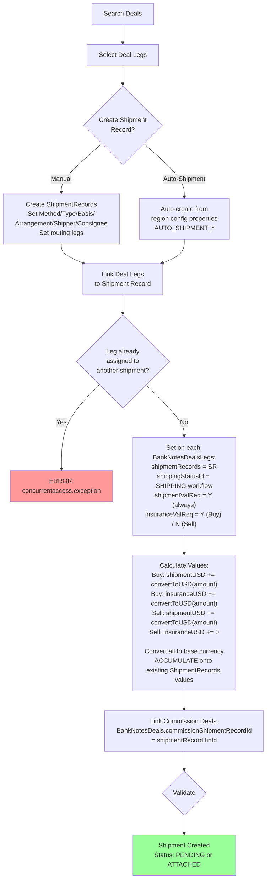

---

## 5. Vault Processing State Machine

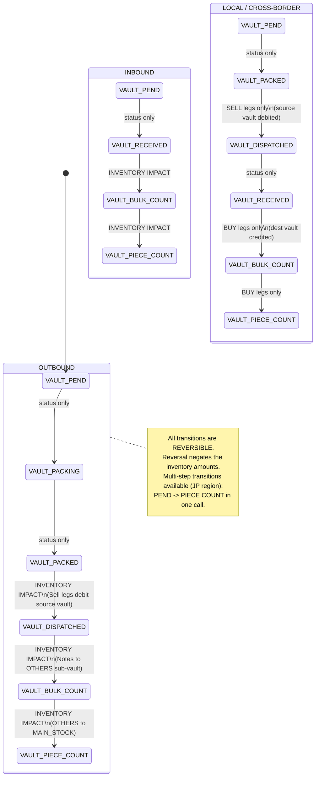

---

## 6. Vault Inventory Double-Entry Pattern

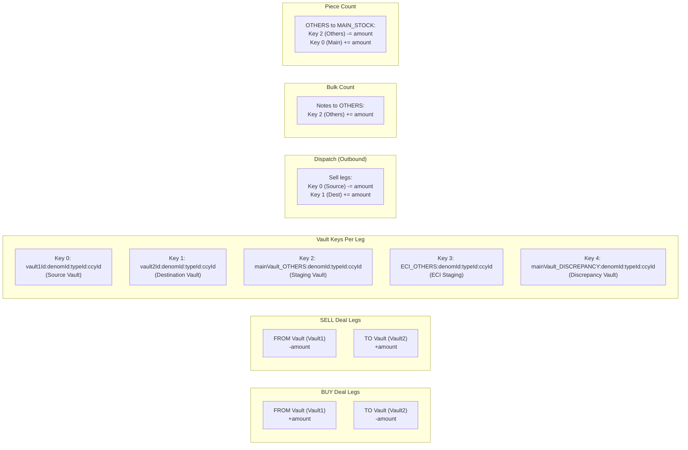

---

## 7. BO Approval Vault Impact

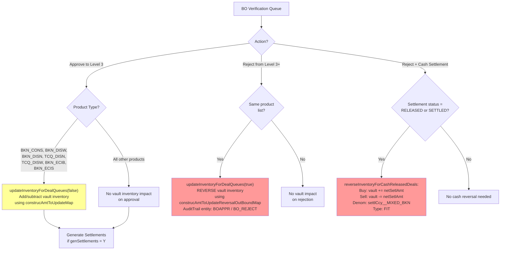

---

## 8. Shipment Release and Auto-Settlement Flow

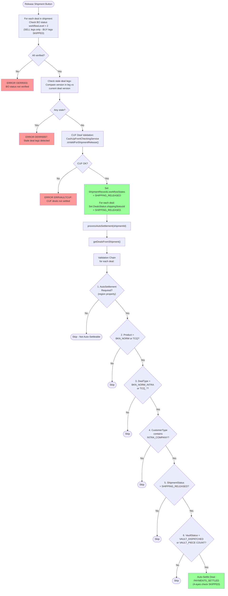

---

## 9. Deal Cancellation Guards

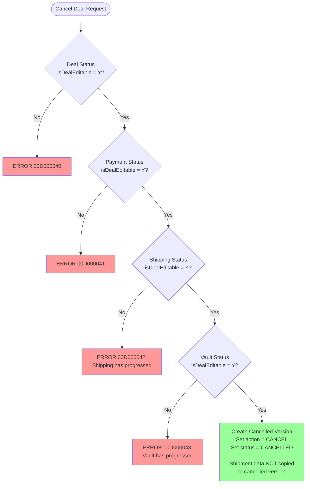

---

## 10. Deal Split Guards

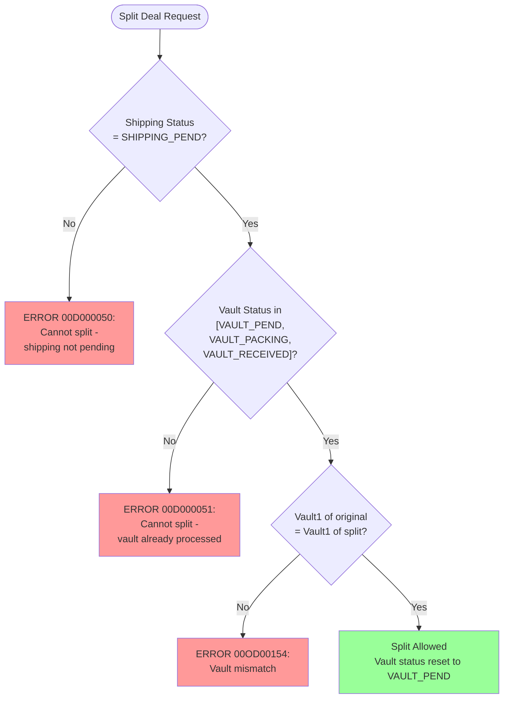

---

## 11. Order-to-Deal Conversion (Shipment Data Transfer)

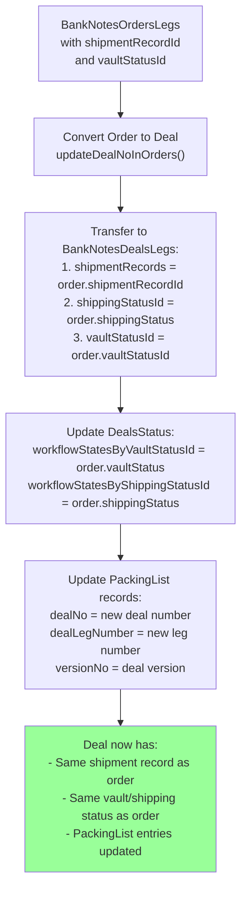

---

## 12. EOD Processing (Shipment/Vault Steps)

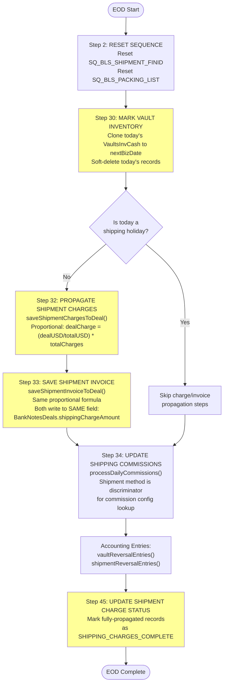

---

## 13. Complete Deal Timeline (Single View)

```
TIME ──────────────────────────────────────────────────────────────────────────────────►

DEAL      ┌─────────┐  ┌──────────┐  ┌───────────┐  ┌──────────┐  ┌──────────┐
STATUS    │ CREATED  │─►│   PEND   │─►│ BO VERIFY │─►│ APPROVED │─►│  MATURE  │
          └─────────┘  └──────────┘  └───────────┘  └──────────┘  └──────────┘

SHIPPING  ┌─────────┐               ┌──────────┐   ┌──────────┐
STATUS    │  PEND   │──────────────►│ ATTACHED │──►│ RELEASED │──► triggers auto-settlement
          └─────────┘               └──────────┘   └──────────┘

VAULT     ┌─────────┐  ┌────────┐  ┌────────┐  ┌────────────┐  ┌──────────┐  ┌────────────┐
STATUS    │  PEND   │─►│PACKING │─►│ PACKED │─►│ DISPATCHED │─►│BULK COUNT│─►│PIECE COUNT │
          └─────────┘  └────────┘  └────────┘  └────────────┘  └──────────┘  └────────────┘
                                                      │               │             │
                                                 INVENTORY       INVENTORY      INVENTORY
                                                  IMPACT          IMPACT         IMPACT

SETTLEMENT                                                    ┌─────────┐  ┌─────────┐
STATUS                                                        │RELEASED │─►│ SETTLED │
                                                              └─────────┘  └─────────┘

INVENTORY                                      ┌──────────────────────────────────────┐
CHECKS     inventory limits ◄──────────────────│ On deal save (commit)                │
           checked at Vault1                   │ InventoryLimitsBreachException       │
           and Vault2                          │ if negative position would result    │
                                               └──────────────────────────────────────┘

SPECIAL    ┌──────────────────────────────────────────────────────────────────────────┐
PRODUCTS   │ BKN_CONS/DISW/DISN/ECIB/ECIS/TCQ_DISN/TCQ_DISW:                       │
           │ ► Vault inventory adjusted on BO APPROVAL (Level 3)                     │
           │ ► Vault inventory REVERSED on BO REJECTION (from Level 3+)              │
           └──────────────────────────────────────────────────────────────────────────┘

EOD        ┌──────────────────────────────────────────────────────────────────────────┐
           │ 1. Reset shipment/packing sequences                                     │
           │ 2. Clone vault inventory to next business date                          │
           │ 3. Proportionally propagate shipment charges to deals (skip on holiday) │
           │ 4. Proportionally propagate invoices to deals (skip on holiday)         │
           │ 5. Process commissions (shipment method = discriminator)                │
           │ 6. Generate vault/shipment reversal accounting entries                  │
           │ 7. Mark fully-propagated charge statuses as complete                    │
           └──────────────────────────────────────────────────────────────────────────┘

GUARDS     ┌──────────────────────────────────────────────────────────────────────────┐
           │ CANCEL: Blocked if shipping != PEND or vault not in [PEND/PACKING/RECV] │
           │ AMEND:  Blocked if shipping/vault isDealEditable != Y                   │
           │ SPLIT:  Requires SHIPPING_PEND + vault in [PEND/PACKING/RECEIVED]       │
           │         Vault1 must match between original and split deals              │
           └──────────────────────────────────────────────────────────────────────────┘
```

---

## 14. Products and Their Vault Integration

```
PRODUCT            VAULT1   VAULT2      VAULT      INVENTORY     SPECIAL
                                        DATES      ON BO APPR    NOTES
───────────────────────────────────────────────────────────────────────────
BKN_NORM           Yes      No          1 date     No            Standard flow
TCQ_TCQN           Yes      No          1 date     No            Standard flow
BKN_CAEX           Yes      Yes(swap)   2+2 dates  No            Cash exchange, dual legs
BKN_DISC/TCQ_DISC  Yes      Yes(disc)   2 dates    No            Discrepancy vault key
BKN_CONS           Yes      No          1 date     YES           Consolidation
BKN_CONT           Yes      Yes(cons)   2 dates    No            Consignment top-up
BKN_CONR           Yes      Yes(cons)   2 dates    No            Consignment return
BKN_ECIB           No*      Yes(ECI)    2 dates    YES           *Does not impact vault
BKN_ECIS           No*      Yes(ECI)    2 dates    YES           *Does not impact vault
BKN_ECIR           Yes      No          1 date     No            ECI receive
BKN_ECIT           Yes      No          1 date     No            ECI transfer
BKN_DISN           No*      No          1 date     YES           *Discrepancy notes
BKN_DISW           No*      No          1 date     YES           *Discrepancy wrapper
BKN_UNRR           No*      No          1 date     No            *Unreported
BKN_COLS           No*      No          1 date     No            *Consolidation sell
BKN_OFFS           Yes      No          NO dates   No            Offshore (no vault dates)
BKN_INTERVAULT     Yes      No          1 date     No            Inter-vault transfer
BKN_PHYFLOW        Yes      No          2+2 dates  No            Physical flow
BKN_EFTSETTLE      Yes      No          1 date     No            EFT settlement
BKN_PHYSETTLE      Yes      No          1 date     No            Physical settlement
───────────────────────────────────────────────────────────────────────────
* "No" vault impact means the MAIN vault is not impacted, but specific
  sub-vaults (DISCREPANCY, OTHERS) may still be updated.
  BKN_DISN/DISW update only the discrepancy vault key.
```
